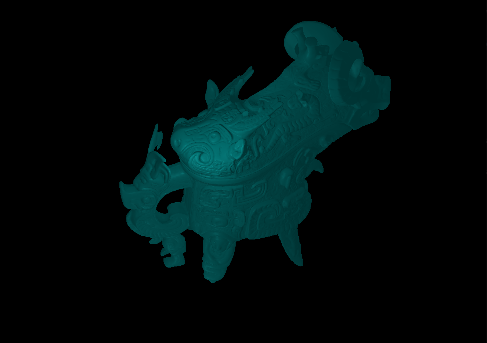
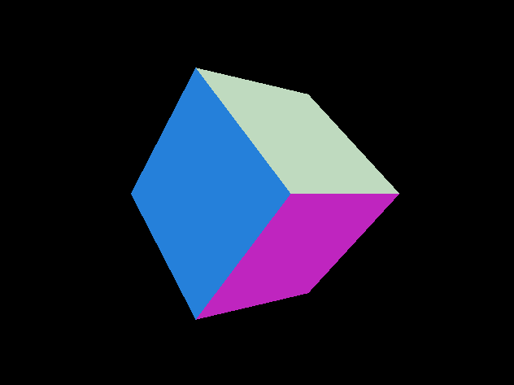

### Implementation Log

This is a personal project to build a rendering engine in WebGPU from scratch.
After taking a few computer graphics courses in OpenGL, I wanted to learn a more modern graphics API and 
implement graphics techniques I was interested in.

So far I have implemented physical based lighting with point lights, and
I plan to add:
- Environment maps/image based lighting
- Glass / transparent PBR material

##### BSDF / Physically based Rendering with Point Lights
  
 
 
 
 

##### Camera control with Mouse
##### Window Resizing

##### Tiny Obj Loading + Texturing

##### Basic Shading
  

##### 2D to 3D

##### Buffers and Uniforms

##### Render Pipeline configuration
- Vertex pipeline, primitive pipeline, vertex/fragment shaders

 

##### Environment Setup
- Conigure with CMake, Visual Studio, and C++, Dawn.
- Set up adapter, device, command queue.
- Create a window with GLFW.
- Refactor with C++ Wrapper Configuration: https://github.com/eliemichel/WebGPU-Cpp 

##### Dependencies
- `wgpu`
- `glfw`
- `glm`
- `tiny_obj_loader`
- stb

##### References

https://eliemichel.github.io/LearnWebGPU/index.html
https://learnopengl.com/PBR/Lighting

##### Models and textures
- https://sketchfab.com/3d-models/lidded-ritual-ewer-guang-c2898500387d40678d26d15d12809608

