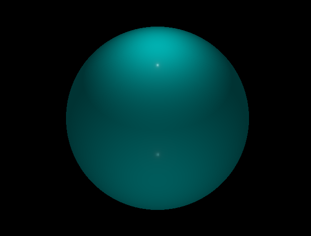
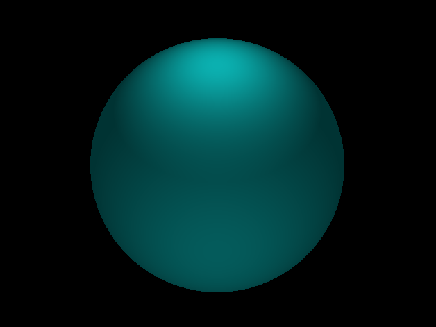
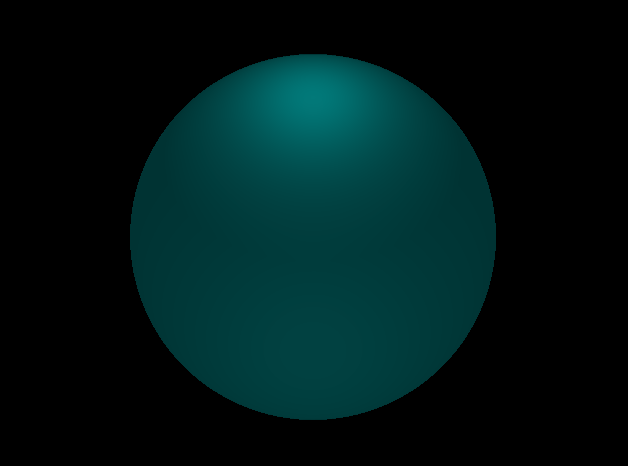
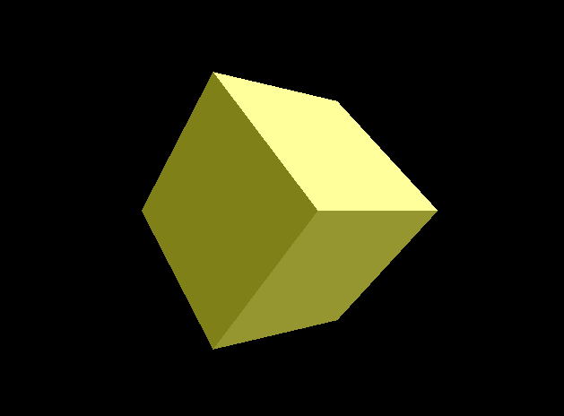

# WebGPU Physically-Based Renderer
https://github.com/user-attachments/assets/570cdce1-4bdc-4390-a506-5a3c78292dd0

This is a personal project to build a rendering engine in WebGPU from scratch.
After taking a few computer graphics courses in OpenGL, I wanted to learn a more modern graphics API and 
implement graphics techniques I was interested in.

So far I have implemented physically based lighting with point lights, and
I plan to add:
- Environment maps/image based lighting
- Glass / transparent PBR material

## Implementation Log
<table>
  <tr>
    <td colspan="2" align="center"><b>BSDF / Physically Based Rendering with Point Lights </b></td>
  </tr>
  <tr>
    <td align="center">
      
    </td>
    <td align="center">
      
    </td>
  </tr>
</table>

<table>
  <tr>
    <td colspan="2" align="center"><b>Cook Torrance Roughness / Metallicness Comparison</b></td>
  </tr>
  <tr>
    <td align="center">
      
    </td>
    <td align="center">
      
    </td>
  </tr>
  <tr>
    <td align="center">
      
    </td>
    <td align="center">
      
    </td>
  </tr>
</table>

<!-- Tiny Obj Loading + Texturing -->
<table>
  <tr>
    <td align="center"><b>Tiny Obj Loading + Texturing</b></td>
  </tr>
  <tr>
    <td align="center">
      
    </td>
  </tr>
</table>

 

<!-- Basic Shading -->
<table>
  <tr>
    <td colspan="2" align="center"><b>Basic Shading</b></td>
  </tr>
  <tr>
    <td align="center">
      
    </td>
    <td align="center">
      
    </td>
  </tr>
</table>

 

<!-- 2D to 3D -->
<table>
  <tr>
    <td align="center"><b>2D to 3D</b></td>
  </tr>
  <tr>
    <td align="center">
      
    </td>
  </tr>
</table>

 

<table>
  <tr>
    <td colspan="2" align="center"><b>Rendering Pipeline/Buffers Setup </b></td>
  </tr>
  <tr>
    <td align="center">
       
    </td>
    <td align="center">
      
    </td>
  </tr>
</table>

### Other Features
- Camera control with Mouse
- Window Resizing

### Environment Setup
- Conigure with CMake, Visual Studio, and C++, Dawn.
- Set up adapter, device, command queue.
- Create a window with GLFW.
- Refactor with C++ Wrapper Configuration: https://github.com/eliemichel/WebGPU-Cpp 

### Dependencies
- `wgpu`
- `glfw`
- `glm`
- `tiny_obj_loader`
- `stb`

### References

- https://eliemichel.github.io/LearnWebGPU/index.html
- https://learnopengl.com/PBR/Lighting

### Models and textures
- https://sketchfab.com/3d-models/lidded-ritual-ewer-guang-c2898500387d40678d26d15d12809608
- https://3d.si.edu/object/3d/triceratops-horridus-marsh-1889:d8c623be-4ebc-11ea-b77f-2e728ce88125
- https://3d.si.edu/object/3d/pair-blue-sneakers-worn-wellington-webb-while-campaigning:3ab80a3a-6099-48f7-9861-c454daa048ef

